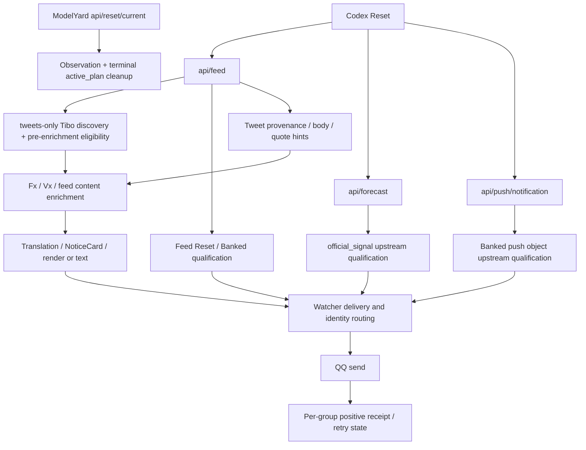

# Tibo discovery 解耦调查与分阶段设计

日期：2026-10-09，UTC+8。状态：**设计已 review 通过；Stage 1 dev 实施完成，详见 [STAGE1_IMPLEMENTATION.md](STAGE1_IMPLEMENTATION.md)。生产未部署。**

## 1. 结论、范围与身份核验

Tibo full-push 当前漏报的直接原因是 discovery 输入不完整：生产只从 Codex Reset
`/api/feed.tweets[]` 建立候选，而该集合已经是业务筛选后的投影。`source_scope=timeline`
和 `stale=false` 并不保证它包含账号完整动态。`radar_context[]` 的滚动上下文能证明
部分遗漏，却也不能提供完整历史、可靠 reply 元数据或稳定补洞能力。

推荐 Stage 1 使用 **FxTwitter v2 用户 statuses discovery**，显式取得带回复列表，
并与普通 statuses 列表合并；Codex Reset 退为有明确覆盖限制的 fallback/cross-check。
这是本轮实际验证能够发现遗漏帖、提供结构化关系、并成功翻页的独立公开来源。
该推荐仍有运行验收条件，尤其是分页短暂失败、上下文混入和原站完整性验证缺口。
本轮没有找到第二个已经通过实测的、独立于 Fx 的完整公开 timeline provider。

开始时 `git ls-remote origin` 核验：

| 对象 | 给定/实际身份 | 结果 |
|---|---|---|
| dev | `4229dec8f864ca3e472919ca8f9acb011d83dbfb` | 远端一致；本地 HEAD 一致 |
| main | `90174ae7d59ab75d7a6fe6e6c5f826063ac7ccd6` | 远端一致 |
| production live | `fa09454985ee4dde04e01f2acc7b6340166c2abf` | 实际 live 关键运行文件与该 commit 的 Git blob 字节一致 |

production 是复制安装树，没有把 live 路径假称为 Git branch。SSH 只读计算实际文件
SHA256，并与本地 `git show fa094549…:<path>` 比较：

| live 文件 | SHA256 |
|---|---|
| `plugin.py` | `33656aae3afd93767e88ae96588b2524ff4f837059c89de33ce317c2532ca209` |
| `notice_card.py` | `cb5548c05164a2d796920e5890031fe8793b1b414eaa1b26211f59db9e9ed236` |
| `_manifest.json` | `d399d62ac4fd9fdd3f4f9adc04e2dba0566f64506818956d00fe7dc700d840ff` |

范围严格限于只读调查、本地取证辅助脚本和本文件：无 main merge、生产部署、tag、
Release、Marketplace、人工补发、state/receipt 写入或 MaiBot Core 修改。
未 commit、未 push。本轮未启动长期后台监控任务。

## 2. 证据保存与证据等级

新取证目录在仓库外：

`/home/dev/acceptance-evidence/codex-reset.watcher/20261009-decoupling/`

该目录包含原始 HTTP body、请求 URL/UTC 时间/HTTP 状态/headers/hash、生产只读快照、
历史快照索引、纯函数离线分析脚本和 SHA256 清单。生产 state 和 QQ 只读查询结果
保留在此私有目录，未加入安装树或 Git。所有本轮 HTTP 请求都是公开 GET；SSH 使用
既有连接读取文件和日志，SQLite 使用 `mode=ro`；未调用任何 QQ send 接口。

| 证据 | 文件 | 用途/限制 |
|---|---|---|
| 当前生产 feed | `host_feed.body`、对应 `.meta.json` | 来自生产服务器网络的公开 GET，非捕获某次 Watcher 内存中的 HTTP 响应 |
| 当前配置/state/日志 | `production-readonly.json` | 13:05 UTC 读盘；日志 10-08 08:48 至 10-09 13:02 UTC，有 Host/Runner 重复记录 |
| 完成前复核/较早投递日志 | `final_readonly.json` | 再读 code/config/state hash；筛选保留自 10-06 13:00 UTC 的 Watcher 日志 |
| 历史 feed 索引 | `history-index.json` | 指向 12 个已有原始快照，记录源文件 hash 和 JSON 路径；不伪造连续历史 |
| Fx discovery | `host_fx_v2_replies.body`、`fx_replies_page2_retry.body`、`fx_replies_page3.body` | 3 页 with-replies 原始成功响应；另存首次分页失败响应 |
| Fx 普通列表 | `host_fx_v2_posts.body`、`fx_posts_page2.body` | 交叉检查原始帖、self-reply、重复和分页 |
| Fx 单帖 golden | `host_fx_golden.body`、`fx_210*.body`、`fx_poll_golden.body` | 已知遗漏帖、reply-to-other、self-reply、quote、note、poll 的结构化核验 |
| 72h 对照清单 | `tweet-ledger.json` | 53 条唯一 Tibo 帖子逐条分类及两群 state；这是已观察集合，非原站全量认证 |
| 应推遗漏 golden | `golden-missing.json` | 12 条遗漏；含时间、关系、正文、来源、48h 状态及逐群 receipt |
| QQ 旁证 | `qq_bot_messages.json` | 两正式群 bot 消息的只读查询；图片文本为 `[图片]`，不能单独把图片绑定到 Tweet ID |
| 候选源码 | `fx_*source.body`、`vx_*source.body`、`fx_commit.body`、`vx_commit.body` | pinned 官方仓库源码；不等同于证明公开站点部署了该 SHA |

离线分类是从 **production fa094549 的 `is_tibo_main_post()` AST 提取纯函数**，
把 Fx 结构化关系适配成现有输入后执行。没有加载 live 插件、启动机器人、调用 LLM
或执行 `_deliver_notice()`。该分析证明现有资格规则会允许哪些候选；不把它称为生产发送验收。

## 3. Phase A：漏报事实与时间边界

### 3.1 当前与历史 feed

| feed `fetched_at`（UTC） | `newest_post_at`（UTC） | `tweets` / `radar_context` | scope / stale | 应推但仅在 radar 的已知例子 |
|---|---|---|---|---|
| 10-07 10:13:27 | 10-07 05:10:46 | 43 / 10 | timeline / false | `2107599996225007892`，self-reply + poll；还有 `2107676900894417277` |
| 10-07 14:24:48 至 15:29:48 | 10-07 05:10:46 | 43 / 10 | timeline / false | 上述分歧继续存在 |
| 10-08 07:23:15 | 10-08 06:44:31 | 46 / 10 | timeline / false | `2108084615349170480`，Day 3 encore |
| 10-08 08:34:15 至 08:56:15 | 10-08 06:44:31 | 46 / 10 | timeline / false | encore 仍缺失，跨 fa0945 reload 前后 |
| 10-09 13:06:14 | 10-09 05:25:16 | 46 / 10 | timeline / false | encore、Day 4、Today ChatGPT |

当前 `tweets[0]` 仍是 `2108040921044639779`，发布时间 10-08 03:44:55 UTC。
`newest_post_at` 已推进到 10-09 05:25:16 UTC，`radar_context` 包含更晚的新动态。
当前 radar 每项包含 `display_kind=context`、`visibility_only=true`，但没有
`is_reply` / `replying_to` 等资格所需字段。由此可直接看到两个集合的用途差异。

**能证明的最早观察点是 2026-10-07 10:13:27 UTC（18:13:27 UTC+8）**：已有
`feed.raw.json` 快照记录了 radar-only self-reply。该帖本身发布时间是 10-06
22:32:51 UTC。不能把帖子的发布时间当成上游开始过滤的精确时间，也不能声称
10-07 10:13 是第一次发生；更早连续 feed 抓包不存在于本轮所读证据中。

### 3.2 72h 应推遗漏清单

对照窗口约为 **10-06 13:06 至 10-09 13:06 UTC**。Fx 两种列表加分页共观察到
53 个唯一 Tibo authored ID，现有纯资格函数允许 20 条，其中 12 条不在当前
`tweets[]`。下表是这 12 条；UTC+8 显示时间。它们在两个正式群
`930652120` / `858765219` 的 **seen、tibo_delivered、tweet receipt、tibo receipt
均为 false**。完整逐群字段在 `golden-missing.json`。

| Tweet ID | 发布时间（UTC+8） | 结构化类别/内容 | 现有 full-push 资格 | 取证时 ≤48h | 当前 radar |
|---|---|---|---|---|---|
| `2107504197012988007` | 10-07 00:12:10 | self-reply，Auto-review 使用说明 | 是 | 否 | 无 |
| `2107548725359104441` | 10-07 03:09:07 | quote + 自己评论，Day 2.2 | 是 | 否 | 无 |
| `2107573405553938664` | 10-07 04:47:11 | quote + 自己评论，Day 2.3 | 是 | 否 | 无 |
| `2107574912349303197` | 10-07 04:53:10 | quote + 自己评论，Day 2.4 | 是 | 否 | 无 |
| `2107576143285219799` | 10-07 04:58:04 | self-reply，Vote；poll | 是 | 否 | 无 |
| `2107597780352950624` | 10-07 06:24:02 | original，math proofs | 是 | 否 | 无 |
| `2107599996225007892` | 10-07 06:32:51 | self-reply，To calibrate；poll | 是 | 否 | 无，历史 radar 有 |
| `2107676900894417277` | 10-07 11:38:26 | self-reply，`@ForwardEditor It ended well` | 是 | 否 | 无，历史 radar 有 |
| `2107912709715132482` | 10-08 03:15:27 | quote + 自己评论，new GPT-6 | 是 | 是 | 无 |
| `2108084615349170480` | 10-08 14:38:33 | quote + 自己评论，Day 3 encore / Codex Cloud | 是 | 是 | 有 |
| `2108275041276420573` | 10-09 03:15:14 | quote + 自己评论，Day 4；`is_note_tweet=true` | 是 | 是 | 有 |
| `2108349826727588000` | 10-09 08:12:24 | original，Today ChatGPT | 是 | 是 | 有 |

`2107676900894417277` 的 parent 是 Tibo 自己的 `2107647946032664948`，
所以现有函数允许它。parent 本身回复别人不改变直接 reply target；本轮不悄悄
增加 thread-root 过滤。正文的 `@ForwardEditor` 不能推翻结构化关系。

同窗口其余 33 条观察到的 Tibo 帖子按结构化关系排除为 reply-to-other，不能把
所有 radar-only 条目当作应补发。例如当前最新 `2108428560822424062` 的 target
是 `SimonasLTU1`，`2108086116683526498` 的 target 是 `Angaisb_`，均不推送。
本次样本未观察到 pure repost；其排除仍是产品约束，不能宣称已完成真实 repost 验收。

### 3.3 Root cause 与其它故障的区分

源码依据以 production
[fa094549 的 plugin.py](https://github.com/ShiinaWhite/Codex-Reset-Watcher/blob/fa09454985ee4dde04e01f2acc7b6340166c2abf/plugin.py)
为准，本地 dev 对应调用点也相同：

1. `_check_once()` 取得 feed，然后 `_process_tibo_posts(feed, groups)`。
2. `_process_tibo_posts()` 检查 `profile.handle`、`source_scope`、`stale`，只读
   `feed.get("tweets")`，没有 radar discovery。
3. 只有这个集合中通过 `is_tibo_main_post()` 的 ID 才参与 seen/age 判定、登记
   `_inflight["tibo:<id>"]`、创建 `_tibo_pipeline()`。
4. enrichment、translation、render、chronological barrier、receipt、QQ send
   均在此之后。未进入 `tweets` 的 ID 到不了上述环节。

| 怀疑项 | 当前证据与结论 |
|---|---|
| ordering barrier / per-group inflight | 缺失 ID 没有 discovery 入口，无法为它登记 Tibo attempt 或等待 barrier。排序只约束已经发现的候选。没有读取进程内 `_inflight`，不伪称做了 live 内存检查。 |
| receipt / dedup | 两群所有 12 条的四类相关字段均缺失；baseline 均已完成。不存在“这些 ID 已送达所以被压掉”的 state 证据。 |
| render / QQ send | 保留日志没有这些 ID 的投递记录或管线异常；10-08 11:50 UTC+8 旧候选 `2108040921044639779` 两群正常 `action=sent`，有对应 QQ 图片旁证。不存在缺失候选到达 render/send 的证据。 |
| fa0945 部署 | runtime 关键文件字节匹配；encore 的缺失在 reload 之前 07:23 UTC 快照已经存在，reload 后仍缺失；更早 10-07 快照也已有分歧。不是部署引入的 discovery regression。 |
| 短暂 HTTP 故障 | 日志确有两次 timeout warning（重复日志去重前会出现四行），不是完全零故障。但持续 fresh feed 快照仍不含这些 ID，短暂网络失败无法解释稳定的字段遗漏。 |

这里“排除”指 **这些遗漏的因果位置在候选生成之前**，不泛化成整套下游从未出过故障。
QQ 表中 `[图片]` 不包含 Tweet ID，单独不能证明某张图片是某条 Tweet；正向绑定依赖
Watcher delivery log + receipt，负向结论主要依赖输入边界与缺失 state。

本轮开始/完成前 config SHA256 均为
`1fbb3f8ecdbf413ff4fcef000c6c5789a4f2eb5ee66bd44c72a301fe794d55b9`，state 均为
`0c04dcb493b5e220e549b8c42773a3f3d44620f7c846c4ed3e10dd0a2203e2a5`；关键 code hash
也相同。没有用人工 state 修改制造恢复或验收结果。

## 4. 当前 Codex Reset 耦合图



额外耦合：`_event_tibo_id()` 和 `_event_notice_content()` 从 feed 的 tweets/events
join provenance，`_enrich_content()` 以 feed 同 ID 原文/quote 作最后提示，
`_fetch_conclusion()` 仍请求 ModelYard 并用 feed join 辅助观察。仅替换 full-push
的 discovery 参数不足以消除这些依赖；Stage 1 只切开候选生成入口及 Tibo enrichment
的 hint 参数，Reset/Banked 的现有资格判定仍留在原路径。

## 5. Phase B：来源实测

### 5.1 FxTwitter v2：推荐的 primary discovery

实测公开请求，不使用用户 X 登录、cookie 或新增凭据：

```text
GET https://api.fxtwitter.com/2/profile/thsottiaux/statuses?count=100&with_replies=true
GET https://api.fxtwitter.com/2/profile/thsottiaux/statuses?count=100
GET .../statuses?count=20&with_replies=true&cursor=<bottom>
GET .../statuses?count=20&cursor=<bottom>
```

文档确实提供
[用户 statuses](https://docs.fxembed.com/api/twitter/operations/2profilehandlestatuses/)
与 cursor 分页；本轮不是把 `/thsottiaux/timeline` 猜成接口，该猜测路径实测 404。
运行时 OpenAPI 也实际返回 200，保存为 `host_fx_v2_spec.body`。

官方源码固定到 `f3d17f0484c2c9a3ed7ff8a14dde6d004051ff52`：

- [routes/twitter.ts](https://github.com/FxEmbed/FxEmbed/blob/f3d17f0484c2c9a3ed7ff8a14dde6d004051ff52/src/realms/api/routes/twitter.ts#L218)：`profileStatusesAPIRequest` 传递 count/cursor/withReplies，且 `since` 只对无 cursor 的首屏做 204 判断。
- [userStatuses.ts](https://github.com/FxEmbed/FxEmbed/blob/f3d17f0484c2c9a3ed7ff8a14dde6d004051ff52/packages/atmosphere/src/providers/twitter/userStatuses.ts#L51)：调用 X 的 profile timeline / user tweets 查询；with-replies 选择 `ProfileWithRepliesTimeline` / `UserTweetsAndReplies`，普通列表选择 `ProfileTimeline` / `UserTweets`。
- 同函数逐帖 build，失败/不可用条目会被过滤，然后仍可能返回 code=200。
  所以 **HTTP 200 不是全量无遗漏证书**。公开站点实际部署 SHA 无可核实标记，
  以上 SHA 是本轮取到的官方源码身份。

| 检查项 | 实测结果 |
|---|---|
| 用户最近列表、ID、时间 | 成功；`results[].id` / `created_timestamp` / `created_at` / author |
| 最近多少条 | `count=100` 带回复首屏返回 31 行，其中 20 个 Tibo authored；普通首屏 21 个 Tibo authored。请求 count 不是实际账号条数保证。 |
| 分页 | `cursor.bottom` 存在；带回复第 2、3 页成功返回 35/28 行，Tibo authored 分别 21/20；第三页已到 10-06 03:27 UTC。普通第二页返回 20 行，有首屏重叠。 |
| 分页失败 | 首次第 2 页 count=100 返回 HTTP/code 404、空 results；同 cursor 改 count=20 再取成功。不能归因为 count，也不能把首次 404 当“已经到底”。 |
| 排序 | 上下文/线程排列，不是严格时间倒序；普通首屏有 5 处时间逆序，带回复首屏过滤 author 后仍有 2 处。core 必须自行排序。 |
| 重复 | 单页所见 Tibo ID 无重复；普通跨页至少重叠 `2107368734981517634`，两种列表大量重叠。必须按 Tweet ID 合并。 |
| reply-to-other | 带回复列表能发现；结构化 `replying_to={screen_name,status,...}`。列表还带其它作者 parent/context，不可全部当 Tibo 候选。 |
| self-reply | 两种列表都实际出现 Day 3 continuation、Good evening、To calibrate 等；不能依赖普通列表永远提供所有 self-reply。 |
| quote | 多条 quote 含 nested ID/author/body；单帖接口再次确认 encore、Day 4、新 GPT-6 的 quote。 |
| 长帖 | Day 4 `is_note_tweet=true`，列表能发现，单帖原文长度 281；证明 note 类发现，不等同于超长 article 全文测试。 |
| poll | To calibrate 单帖 poll、Four updates 引用 Vote 的 poll 实测存在。复用现有 poll 解析/展示。 |
| repost | schema/源码有 `reposted_by`；本次所见样本为 null，没有真实 pure repost fixture，完整性/分类待实现验收补齐。 |
| 延迟 | 本轮成功快照最新 Tibo ID/time 与 Codex radar 最新一致。没有新帖首次到达的连续观测，不能量化 Fx discovery latency 或承诺 SLA。 |

推荐 adapter 校验 ID 为 ASCII 十进制、author handle 为 `thsottiaux`，优先绑定本轮
响应中一致的 author ID `1953337039510003712`。author 不是 Tibo 的上下文条目不能作为
Tibo authored 候选；`reposted_by` 有值的 repost 是另外一种关系，不借用其原作者时间
构造 full-push 候选。relation 字段缺失与明确 null 必须区分。

### 5.2 ModelYard：分类事件，适合作为有限提示

`https://tibo.modelyard.dev/api/events` 实测 200：20 个分类事件，顶层
`data` / `nextCursor` / `total`；每项 `id` 是本地事件号，Tweet ID 应从已验证的
`source_url` 取，不能拿事件号作 Tweet ID。含 `published_at`、`source_account`、
`source_text`、verification、category 和摘要。当前最新是 encore；Day 4 和 Today
ChatGPT 没有进入这份事件列表。

实际主页 `/app.js` 仍围绕 `/api` 下分类事件进行显示/分页；
`/feed.xml` 实测 200，是该产品的事件 RSS；猜测 `/api/tweets` 实测 404。
[站点 methodology](https://tibo.modelyard.dev/methodology/) 也界定其记录公开告示和产品政策。

该来源能把已分类帖的 ID/time 当 hint，历史事件含 continuation，**没有实证能取
完整账号 timeline**。事件 cursor 是事件分页，不是所有 X 动态 cursor。缺
可靠 is_reply/target/repost/quote/poll，source text 含 `@` 不能代替关系元数据。
不能作为 full-push primary，也不能把其 AI 类别带入 Watcher 自行重判告警资格。

### 5.3 VxTwitter：源码有 feed 能力，但当前公开端点未通过可用性验证

不能笼统断言 Vx 只有单帖 API。官方
`dylanpdx/BetterTwitFix` 源码固定到
`761cbb8881a9e637338217896ac29ddb33e52188`：

- [twitfix.py](https://github.com/dylanpdx/BetterTwitFix/blob/761cbb8881a9e637338217896ac29ddb33e52188/twitfix.py#L327)
  的 `getUserData(..., includeFeed=True)` 调用 `extractUserFeedFromId`，输出
  `latest_tweets`；profile 路由使用 query 中是否存在 `with_tweets` 来启用它。
- `/with_replies` 路径会落同一个 profile 处理，但所读代码没把该路径传给
  `getUserData` 控制 reply inclusion，因此不能据路径名认定包含全部 replies。
- [vxApi.py](https://github.com/dylanpdx/BetterTwitFix/blob/761cbb8881a9e637338217896ac29ddb33e52188/vxApi.py#L282)
  有 `replyingTo` / `replyingToID` / `retweetURL` / `qrtURL` / `pollData`，
  quote body 可以另取。源码证明字段处理，不是本次线上成功返回的证明。

本轮从 WSL 与生产服务器请求 profile、猜测 timeline、v2、已知单帖均遇到
403 HTML challenge；最后对真正的 `?with_tweets=1` 和
`/with_replies?with_tweets=1` 也实测 403。没有绕过 challenge、登录或改变生产网络。

结论：保留 Vx 作为既有 enrichment fallback；其 discovery **有源码线索但运行
能力未验证**，不能推荐为可工作的 primary/完整 fallback。数量/分页/self-reply
覆盖/顺序/延迟均未知。本轮 403 不否定已有历史成功单帖 fixture，但历史成功
不能代替当前可用性验收。

### 5.4 其它公开能力与原站验收缺口

| 来源 | 实测 | 结论 |
|---|---|---|
| Fx RSS | 文档存在 `/thsottiaux/feed.xml`；公开 Fx 请求 404，API host 同路径也 404 | 本次不可用；即使成功也与 Fx API 同故障域，不能算第二个独立 provider |
| X profile / with_replies | WSL SSL EOF/timeout；生产 SSL handshake timeout；web 工具未取得当前完整列表 | 没有原站完整 timeline，不能完成零漏帖对照 |
| X syndication profile | 生产 handshake timeout | 没有可用 timeline 响应 |
| Nitter `nitter.net/.../rss` | 生产 network unreachable | 本次不可用；不推导所有实例的结论 |
| TwStalker 当前 profile | 生产 network unreachable；搜索缓存的时间/内容明显不适合作当前快照 | 不用搜索缓存证明当前 72h 完整性 |

golden 核验覆盖：encore、Day 4、Today ChatGPT、new GPT-6、To calibrate、明确
reply-to-other、Day 3 self-reply；Fx 普通列表和带回复三页均能交叉找到相关 ID。
ModelYard 再确认 encore 的 ID/time；Codex radar 再确认三条较新的 ID/time。

**限制**：上述交叉面存在共同上游，无法替代独立原站全集。53 条是已观察到的
union，下游遗漏数 12 是相对此集合，不是宣称账号 72h 总共只有 53 条。
独立 X 原站 72h 列表、真实 repost、超长 article、连续 discovery 延迟仍是 Stage 1
上线验收前的未闭合项目。不得把本报告当作可以立即生产切换的验收证书。

## 6. Phase C：provider boundary 与内部 schema

Stage 1 用一个小 adapter 模块和明确对象即可，不引入 provider registry、插件化
调度框架或通用工作流引擎。以下是合同草案，不是本轮已经添加的 Python 类型。

```python
@dataclass(frozen=True)
class TweetCandidate:
    tweet_id: str                  # ASCII numeric; canonical business key derives from this
    published_at: datetime | None  # timezone-aware actual provider time; no snowflake inference
    discovery_sources: tuple[str, ...]  # diagnostics/provenance, never dedup identity
    observed_at: datetime
    author_handle: str | None
    basic_metadata: TweetMetadata | None
    content_hint: TweetContent | None  # real source text/quote, never event summary

@dataclass(frozen=True)
class TweetMetadata:
    author_handle: str | None
    author_id: str | None
    is_reply: bool | None           # unknown != False
    replying_to: str | None
    in_reply_to_tweet_id: str | None
    is_repost: bool | None          # unknown != False
    repost_of_tweet_id: str | None
    quote_id: str | None
    relation_status: str            # verified / unknown / conflict

@dataclass(frozen=True)
class EnrichedTweet:
    tweet_id: str
    published_at: datetime | None
    metadata: TweetMetadata
    content: TweetContent | None    # existing text/completeness/quote/poll representation
    provenance: tuple[str, ...]

@dataclass(frozen=True)
class DiscoveryBatch:
    candidates: tuple[TweetCandidate, ...]
    status: str                    # ok / partial / unavailable
    observed_window: tuple[datetime | None, datetime | None]
    sampled_at: datetime
    issues: tuple[str, ...]         # page failure, cap reached, malformed row, etc.
```

provider 持有 HTTP 原始 schema、参数、cursor、header、status/错误翻译、作者上下文
过滤和字段映射；core 只读 candidate/enriched/batch，不知道 feed 字典或 Fx/Vx 字段名。
`observed_window` 只是所见时间跨度，不命名为“全量完整覆盖”。cursor 不进入 receipt。
Stage 1 不必增加持久化 cursor/high-water：每轮从最新页取有重叠的时间窗口，已有
Tweet receipt 去重。若以后加 transport cache/cursor，其作用也只是性能，不能作为已送达证据。

建议处理流程：

```text
parallel start: existing feed / forecast / notification sampling + Tibo discovery
  Fx ordinary statuses + with-replies statuses, bounded pagination
  Codex tweets/radar hints -> fallback adapter
      -> merge by tweet_id; accumulate provenance; preserve unknown/conflict
      -> validate author/id/time; reuse 48h and existing group baseline
      -> register dated attempts in existing inflight/order mechanism
      -> ensure reliable reply/repost metadata (Fx/Vx; parent author lookup if needed)
      -> existing eligibility predicate over normalized structured fields
      -> existing content enrichment + translation + card/text presentation
      -> existing per-group barrier and _deliver_notice
      -> successful per-group receipt + seen; failures release attempt and retry
```

metadata 未明确前可以先做 discovery，但 **不能把未知 is_reply 映射为 false**。
Fx v2 `replying_to` object 映射 target/parent，明确 null 只在有效、预期字段齐全的
provider 对象中表示非 reply；缺字段、坏类型、author 不匹配、相互矛盾均进入 unknown。
Vx similarly 映射 `replyingTo` / `replyingToID` / `retweetURL`；只有 ID 没有 target
时，可取 parent 验证 author，仍无法确认就等待。text 前缀 `@...` 不参与 reply 判断。

多 provider 同 ID 合并成一个候选。发布时间或关系冲突时不简单 last-wins、优先级
填 null，也不新建两个 attempt；可靠单帖/parent 元数据能解决才继续，不能解决不送、
不标 seen。不得让 Code Reset 的未提供字段覆盖 Fx 的明确结构化关系。

现有 `TweetContent` 主要是内容/展示对象，**没有完整 reply/repost 资格合同**。
因此不能机械地把 feed prefilter 删除，然后仅调用 `_enrich_content()` 就发送。
Stage 1 至少需要 metadata adapter/验证步骤；复用其内容提取、quote/poll、翻译和
render 逻辑，避免把资格判断混进 formatter。

排序应先按解析后的 UTC instant + ID 对候选排序，且为已知 dated 候选在异步
metadata/content 准备前登记排序参与者。未知/冲突/排除/失败必须释放该群完成事件，
不让一个 unresolved reply 永久堵住后续帖。不要把所有 enrichment 顺序执行；
继续并发准备、逐群屏障发送。若 metadata 后修正时间，先取消旧 attempt，再按
最终时间登记，不能静默改变正在被其它任务等待的排序键。

## 7. Primary、fallback 与 failure semantics

### 7.1 推荐策略

- **primary：Fx v2**。显式 with-replies 列表，并与普通列表按 ID union；普通列表
  用于 cross-check/self-reply 补洞，它们属于一个 provider，不是互相独立的冗余。
- 初始实现使用实测成功的 `count=20`；必要时逐页取回最近窗口，保持重叠，正常
  polling 仍为 240s。本轮三页带回复覆盖 72h，但不能把“三页”当固定覆盖承诺。
  设总时限/页上限，达到边界输出 partial，不伪称 complete。默认精确预算由 Stage 1
  实现实测定下；不得让分页成为长时间阻塞任务。
- **fallback/cross-check：已有 Codex feed adapter**。fresh `tweets` + `radar_context`
  仅生成 ID/time/hints，不授予 full-push 资格；继续单帖 metadata verification。
  每轮已有 feed 可以交叉检查，primary 返回 partial/unavailable 时明确降级。
- ModelYard 的分类事件仅作可选补洞提示；Stage 1 不强制增加一次事件请求。
  Vx discovery 在 `with_tweets` 真正返回且通过完整性验证后才成为第二独立候选。

这样 `tweets + radar` 不再是 Tibo 架构中心，也不承诺 radar 中曾出现过的帖子会
永远能恢复：当前 `2107912709715132482` 两个集合均没有，但 Fx 能发现。

### 7.2 失败合同

| 情况 | 行为 | state / receipt |
|---|---|---|
| timeout / 429 / 5xx / 403 challenge | 输出 unavailable；有界 retry/backoff，遵循 Retry-After；本轮使用可用 fallback | 不记 candidate seen/delivered、不 reset baseline、不清旧 receipt |
| 200 但错误 code / JSON schema 不符 | 作为 provider failure，不视作空 timeline | 同上 |
| 某分页 404/坏 cursor/重复 cursor/页上限 | 保留已验证页为 partial；下一轮从最新页有重叠重取，记录 coverage gap | 不把没取到的历史当已 seen；不把 404 当 EOF |
| 空有效列表 / 204 | 只能说明该查询当前没有返回候选；`since` 不可作为永久跳过旧洞的 high-water | 不重建 baseline 或删除 receipts |
| 单行 author/id/time 无法确认 | 隔离该行，记录 issue；其它可靠行继续 | unknown 不记 seen；不从 ID 猜时间 |
| reply target/repost relation unknown/conflict | enrichment 修复；仍不明确则跳过此次尝试、下轮再查 | 不误推、不记 seen，释放 attempt/barrier |
| 可靠确认 reply others / pure repost / URL-only | 不推送，保留现有 seen 语义（当前函数预筛排除，不新增持久化排除 receipt） | 不伪造成功 receipt |
| 可靠候选 >48h | 复用现有 age guard；不发送 | 只写现有 age/seen，绝不 promoted 为 delivered |
| 内容/翻译/render 降级 | 资格已经明确时复用现有内容级别、原文、text fallback；资格 unknown 时不能靠内容降级放行 | 成功 send 才 receipt |
| 单群 send 失败/取消 | 该群独立重试；其它群继续；释放该群屏障 | 失败群不落成功 receipt |
| 所有 discovery 不可用 | Tibo 此轮无新候选；明确诊断降级/覆盖未知 | Reset/Banked 车道仍独立工作 |

采样必须并发启动，保持 `/api/push/notification` latest-only 面的及时采样。
不能把多页 Fx requests 串行加在现有三源请求前，也不能增加无界 gather 等待。
Stage 1 的 discovery 总预算不得扩大现有三源 polling 的阻塞上限；分页超预算
交付 partial。处理过程中仍复用原跨车道 receipt/inflight 路由，不用推迟
Reset/Banked 的所有处理来实现新的“全局绝对排序”。

## 8. State / receipt：不需要业务迁移

**业务身份保持 Tweet 本身，canonical coverage 是 `tweet:<tweet_id>`。**
现有 `tibo:<id>` 是车道 identity/inflight 名，不是 provider identity；本轮设计不改
历史 state 拼写，也不批量重写它。`_notice_delivered()` 已把 `tweet:<id>` 视为
Tibo 正向覆盖，`_deliver_notice()` 成功后保留 lane key 并写 `tweet:<id>`。

Stage 1 保持 STATE_VERSION=6、全部既有字段、baseline 标志和配置群一致：

- `tibo_seen_ids`：baseline/age/完成处理；不能当成功发送证明。
- `tibo_delivered_ids`：Tibo 车道成功或已被正向 receipt 覆盖。
- `delivered_notice_keys`：现有 lane identity + canonical tweet coverage。
- Reset/Banked 的其它逐群 keys 和 `upstream_alert_tweet_ids`：原样携带。
- `_delivery_locks`、per-group attempt completion、cancel cleanup、retry：继续复用。

provider 切换 **不能重置 `tibo_baseline_done`、删除 seen、把现有 receipts 批量换名**。
已有群的 unseen 新发现候选仍走 48h 规则；新群保持静默 baseline。provider 请求
失败或明显 partial 不能冒充成功初始基线；尚未可靠 enrichment 的条目不提前
baseline-seen。后续重新确认时沿现有规则处理，不推断 unknown 是排除。

同 ID 被 Fx、Vx、Codex 同时发现只创建一个 attempt。成功只落该群 receipt；
跨 provider 或重启不能产生重复发送。未来任何 provider cache 状态都不得参与
`_notice_delivered()`，也不得用最新 Tweet ID 截断尚未解决的较早候选。

## 9. Provider / core / presentation / state 的责任分配

| 层 | Stage 1 / 长期归属 |
|---|---|
| TiboDiscoveryProvider | 网络、statuses/replies 参数、分页、源 schema 校验、上下文作者过滤、Tweet ID/time、基本元数据、partial/coverage 诊断 |
| TweetEnrichmentProvider | Fx/Vx 单帖/parent 查询、内容完整性、结构化 reply/repost/quote/poll 映射、真实原文 hints；不判 reset/banked 告警 |
| Watcher core | 多源 Tweet ID union、可靠元数据资格规则、48h、baseline、候选重试、每群 chronological barrier、跨车道路由 |
| ResetSignalProvider | 上游明确授予资格的标准化 Reset signal、occurrence/phase/revision/time/source；不把关键词或 LLM 输出变为告警资格 |
| BankedSignalProvider | 上游明确 phase、latest push 对象/observed 生命周期、结构化来源和 alert identity；保持 latest-only 采样限制 |
| Presentation | 原文/摘录标签、translation、quote/poll 卡片、字体、render、文字 fallback；不得推翻 eligibility |
| Receipt/state | positive send 后记账、每群锁、canonical tweet coverage、lane/phase keys、独立 retry、兼容加载；provider provenance 不构成身份 |

未来 `_fetch_feed()` / `_fetch_forecast()` / `_fetch_push_notification()` 适合逐步成为
CodexReset adapter 内部 transport。一个 Codex provider 可复用同次 feed 来产出多个
标准化信号/提示，不要求物理拆成三个独立网络客户端。core 不应再了解
`official_signal` 或 feed 字段名，而只了解显式 `qualified`、kind、phase、revision
等规范化含义。

**上游决定告警资格继续成立**。去掉 Codex Reset 默认依赖的前提是有其它可信
provider 显式提供同等 Reset/Banked 资格合同。Tibo discovery 找到“提到 reset”的
帖子并不生成 reset 告警；LLM 继续只做翻译/presentation，不能成为资格 provider。

## 10. 分阶段实施与验收

### Stage 1：独立 Tibo discovery + Codex fallback

实施边界：一个小的 provider/schema 模块、Tibo 调用入口/metadata eligibility 调整、
必要测试及配置说明；不改 Reset/Banked 的资格定义，不重做模板和 receipt 系统。
`_process_tibo_posts(candidates, groups)` 接受标准化列表，Tibo pipeline 不再接受整个
feed 字典；真实 body/quote hint 通过 candidate/enrichment 对象传递。其它车道仍保留
原 feed 参数，避免把 Stage 2 混进本次最小修复。

必要验收：

1. golden：12 条已知遗漏、明确 other-reply、无 target、self-reply、quote/comment、
   URL-only、pure repost、长 note、poll；body `@` 前缀不参与判断。
2. adapter：200 错 code、缺字段、author/context 混入、分页 404 后成功、重叠/重复
   cursor、时间逆序、不同 provider 相同 ID、关系/时间冲突、budget partial。
3. 用真实生产 state **副本**做 dry-run：已 delivered Tweet 跨 provider 重启不重发，
   两群 unseen ≤48h 进入待投递集合，过期只 age/seen，不篡改真实 state。
4. 保留现有 ordering/per-group inflight/cancel/receipt/QQ failure regression，尤其
   慢群不拖其它群、metadata unknown 不吞 seen、较早失败释放后较新可继续。
5. 保留 Reset/Banked latest-only 并发采样和跨车道成功覆盖规则；Tibo provider
   失败不改变 upstream alert 的资格和原有 fail-open 处理。
6. 在实际生产网络进行只读 repeated probe：验证分页/覆盖边界/预算；补齐可访问的
   原站 72h 对照和真实 repost fixture。无原站条件时必须 review 明确接受剩余风险，
   不能在验收报告中填“原站完整性通过”。

开发、dry-run 完成后另行 review；部署需新的明确授权，本轮不执行。

### Stage 2：抽象 Reset / Banked provider

把当前 Codex qualification surfaces、phase/provenance adapters 与网络 client 封装，
core 接标准化信号，保持 upstream revision、available/arriving/announced 与
receipt 语义。需要对现有 Reset/Banked corpus 做等价 replay；不借此改变产品规则。
目前无需实施。

### Stage 3：Codex Reset 完全可选

配置上可关闭/替换 Codex adapter。独立 Tibo discovery/enrichment/core/receipt
仍能运行；Reset/Banked 若没有提供显式资格的替代 provider，就明确不提供那些
信号，而不是 Watcher 自己猜。只有在替代资格来源与生命周期合同实际可用时，
才称“脱离 Codex Reset 后仍具备同等 Reset/Banked 功能”。目前无需实施。

## 11. 当前漏帖恢复策略

本轮没有补发。未来 Stage 1 经 review/授权投入运行后，从最近窗口正常 discovery
重新发现遗漏，沿既有逐群 positive receipt 和 48h 路径补洞。

取证基准约 10-09 21:06 UTC+8，仍在 48h 内的四条及截止时间为：

| Tweet | 48h 截止（UTC+8） | 恢复动作 |
|---|---|---|
| `2107912709715132482` | 10-10 03:15:27 | 独立 discovery 能发现；当前 tweets/radar 都缺，不可依赖 radar hotfix |
| `2108084615349170480` | 10-10 14:38:33 | discovery + verified quote/non-reply 后正常发送 |
| `2108275041276420573` | 10-11 03:15:14 | discovery + verified note/quote 后正常发送 |
| `2108349826727588000` | 10-11 08:12:24 | discovery + verified original 后正常发送 |

实际恢复时重新读时间和两群 state，不能根据本轮快照假定它们仍未送达或仍未过期。
八条已过 48h 的遗漏保留审计清单，常规恢复不发送；不删除 seen、回填 delivered、
修改发布时间或放宽 age guard。若将来用户明确要求历史人工补发，应作为独立行动
按具体 ID/群重新核验，而不是偷偷并入 provider 切换。

若需要比 Stage 1 更快的临时止血，可另行 review 一个 **radar hint hotfix**：
把 fresh radar 的 ID/time 当额外 discovery hint，先取可靠单帖 reply/repost 元数据，
再走同一个资格/state/ordering 管线。不把 radar 条目直接视为 main-post，也不新增
provider dedup。它能覆盖当前 radar 内三条，却不能恢复当前滚动窗口外的 new GPT-6
及历史遗漏，仍依赖 Codex，且有额外 metadata 调用；不是最终解耦方案。本轮未写、
未部署这个 hotfix，也不声称它只是无风险的一行数组相加。

## 12. Review 的决策边界

- **修复当前生产漏报的最小完整范围：Stage 1 的独立 Tibo discovery + metadata
  eligibility 边界，复用现有 delivery/state/ordering。** 仅 radar hint 是有限止血。
- **架构重构：Stage 2** 的 Reset/Banked 标准对象和 Codex adapter 封装。
- **以后再做：Stage 3** 的完全可选 Codex、其它完整 timeline provider、必要时的
  provider 性能缓存；前提是实际来源合同和验收证据成立。

以上为设计阶段只读调查记录。设计批准后的 Stage 1 实施、验证及 dev 提交见
[STAGE1_IMPLEMENTATION.md](STAGE1_IMPLEMENTATION.md)；生产 live config/state、main 和
发布状态未修改。Stage 2/3 未实施，Stage 1 完成后进入独立 review。
