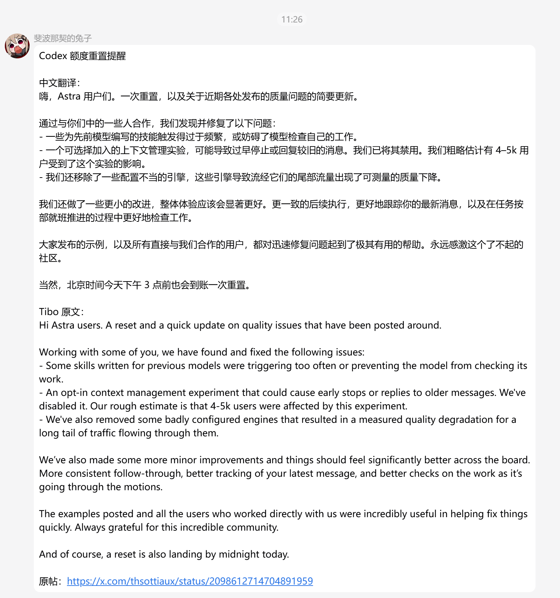
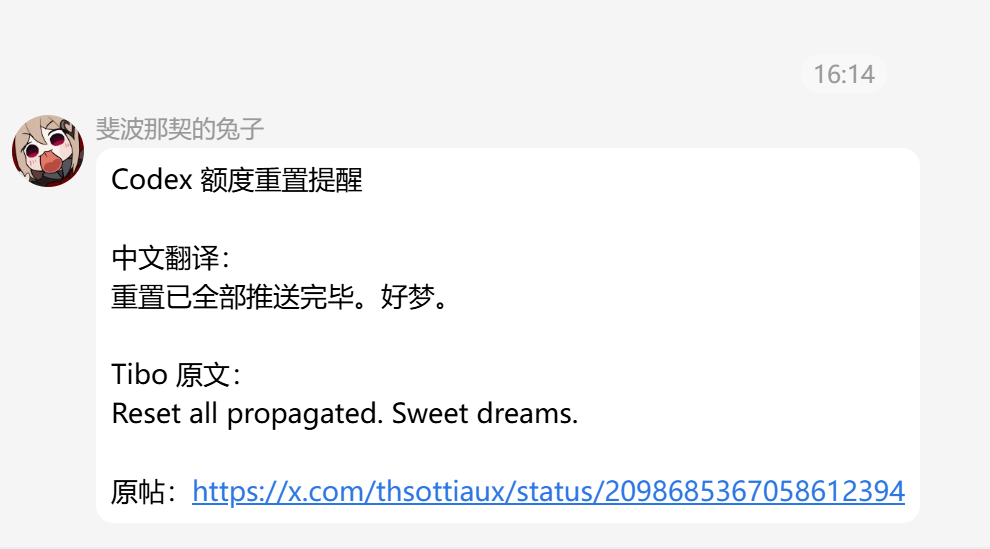

# Codex Reset Watcher（Codex 额度重置提醒）

一个给 MaiBot 用的 Codex 重置提醒插件：自动关注 Codex 全局额度重置、Banked Reset 和上游重置告警，并把重要消息翻译成中文后发送到指定 QQ 群。

- 当前版本：**0.1.12**
- 运行环境：MaiBot Host `1.0.0 – 1.2.99`、SDK `2.8.0 – 2.99.99`（以插件清单声明为准）
- 许可证：MIT

## 你会得到什么

安装并配置好群号后，插件会在后台自动检查公开的 Codex 重置信息。没有新消息时不会打扰你；出现值得提醒的动态时，会发送到 QQ 群。

| 场景 | 你会收到的提醒 |
| --- | --- |
| Codex 全局额度重置 | 上游已经确认值得告警的重置消息，以及后续确认生效的消息 |
| Banked Reset | 上游推送给用户的 Banked 动态，包括生命周期状态暂时不明确但上游已经决定推送的事件 |
| 重置告警 | 数据源面向用户发布的其它 Codex 重置相关告警 |

完整通知通常包含：

**中文翻译 → Tibo 原文（或原文摘录）→ 原帖链接**

翻译由 MaiBot 自带的大模型完成。原文说什么就翻什么，不做摘要；能可靠确定的时间会换算成北京时间并自然融入译文。即使翻译失败，提醒本身也会继续发送。

> 插件只读取公开数据，不登录你的 OpenAI 账号，不读取你的 Codex 额度，也不会替你执行任何重置操作。

## 实际效果

以下截图来自真实 QQ 群里的插件通知：

**长公告会自动附上完整、忠实的中文翻译：**

<p align="center">
  
</p>

**短确认同样会第一时间提醒：**

<p align="center">
  
</p>

## 快速开始

### 方式一：MaiBot 插件市场

插件上架 MaiBot 插件市场后，推荐直接在插件市场搜索 **Codex 额度重置提醒** 安装。

安装后：

1. 启用插件；
2. 打开插件的 WebUI 配置页；
3. 在 `group_ids` 中添加需要接收提醒的 QQ 群号；
4. 保存配置即可。

### 方式二：手动安装

1. 下载或克隆本仓库；
2. 将 `codex_reset_watcher/` 文件夹放入 MaiBot 的插件目录；
3. 让 MaiBot 加载并启用插件；
4. 在 WebUI 中配置接收提醒的 QQ 群。

不需要申请 OpenAI API key，也不需要 X（Twitter）API key。

## 常用配置

日常使用基本只需要 WebUI，不必手动修改配置文件。

```toml
[watcher]
group_ids = []            # 接收提醒的 QQ 群，例如 ["100000001"]
check_interval = 240      # 检查间隔，默认 240 秒（4 分钟）
timezone = "Asia/Shanghai"

[llm]
enabled = true            # 是否启用中文翻译
model_task = "replyer"    # WebUI 推荐选择：replyer / planner / utils
```

完整默认值见 [config.toml](codex_reset_watcher/config.toml)。

## 多群支持

可以同时配置多个 QQ 群。每个群独立发送、独立记录、独立重试：一个群发送失败不会影响其它群。

同一条已经成功发送的告警不会在同一群里反复发送；如果上游把同一件事分成“宣布”“确认生效”等不同阶段分别告警，插件也会按上游实际告警分别提醒。

## 中文翻译

开启翻译后，插件会复用 MaiBot 已有的大模型能力，把 Tibo 原文完整翻译成简体中文。

- 不总结、不压缩、不删减；
- 歌词、玩笑、寒暄、重复内容也会正常翻译；
- 能可靠确定的时间会换算成北京时间；
- 翻译失败或超时，只会少一段中文翻译，不会阻止告警发送；
- 如果拿不到可靠的推文原文，插件不会拿摘要冒充原文，而是只发送标题和原帖链接。

不想使用翻译时，在 WebUI 中关闭 `llm.enabled` 即可。

## Banked Reset 是什么

Banked Reset 不是“当前额度立刻刷新”。

它更接近“把一次重置机会存进账户，之后再由你使用”。因此看到 Banked Reset 提醒时，不要把它理解成当前 Codex 额度已经自动恢复。

插件只负责把上游发布的 Banked 动态及时转发到 QQ，不会替你兑换或使用 Banked Reset。

## 可靠性与已知限制

插件的基本原则是：上游决定什么值得告警，插件负责把已经成立的告警可靠地镜像到 QQ。插件不会再根据 Tweet 文本自己猜“这条到底该不该发”。

发送状态按 QQ 群分别保存。某个群发送失败时，下次会继续重试；已经成功的群不会因此重复发送。

但需要诚实说明一个上游限制：部分 Banked 推送接口只提供“当前最新一条”，没有完整历史记录或游标。

因此，如果插件停机，或者两次检查之间某条 Banked 推送很快又被下一条推送覆盖，那么已经消失的那条消息可能无法找回。0.1.12 覆盖的是检查时仍然可见的上游 Banked 推送，不承诺离线恢复或被覆盖后的补偿。

这不是通过增加本地关键词判断就能可靠解决的问题；完整离线恢复需要上游提供带历史记录或游标的告警接口。

## 常见问题

**重启 MaiBot 后会重复发以前的消息吗？**
正常不会。插件会把已经成功发送的通知记录保存在 MaiBot 数据目录的 `reset_state.json` 中，重启后继续按记录去重。

**离线期间的消息一定能补回来吗？**
不能保证。对于有历史记录的数据可以继续正常判断，但对于只提供“最新一条”的上游推送，如果消息在插件重新看到之前已经被覆盖，就无法从当前接口恢复。

**某个群发送失败怎么办？**
不会影响其它群。失败的群不会写入成功记录，后续检查时会单独重试。

**为什么通知里的时间是北京时间？**
插件面向中文 QQ 群使用，能够可靠确定的时间会按 `Asia/Shanghai` 转换并展示。

**通知太频繁怎么办？**
可以调大 `check_interval`。没有新事件时插件不会发送消息。

**翻译不准怎么办？**
翻译由大模型生成，仅作为阅读辅助。通知会尽量保留 Tibo 原文或原文摘录和原帖链接，方便你自行核对。

**从旧版本升级会丢群配置吗？**
不会。旧的单群配置 `group_id` 会自动迁移到多群列表 `group_ids`。

## v0.1.12 更新说明

v0.1.12 主要修复了一类真实发生过的 Banked 漏报。

此前有一条 Banked 消息已经被上游作为用户告警推送，Telegram 也已经发送，但结构化生命周期状态当时是 `unknown`，旧版插件因此把它静默了。

0.1.12 新增了“上游推送镜像”路径：当插件在检查时观察到上游已经决定向用户推送 Banked 告警，就直接镜像到 QQ，不再因为生命周期状态暂时是 `unknown` 而自行否决。

完整事故取证与回归材料见 [evidence/v0.1.12/](evidence/v0.1.12/)。

## 版本与兼容性

- 当前版本：0.1.12
- MaiBot Host：`1.0.0 – 1.2.99`
- MaiBot SDK：`2.8.0 – 2.99.99`

以上是插件清单声明的兼容范围，不代表所有中间版本都经过逐一实测。

## 问题反馈与许可

- 问题与建议：[GitHub Issues](https://github.com/ShiinaWhite/Codex-Reset-Watcher/issues)
- 开源协议：[MIT](LICENSE)
- 插件代码：[plugin.py](codex_reset_watcher/plugin.py)
- 插件清单：[_manifest.json](codex_reset_watcher/_manifest.json)
