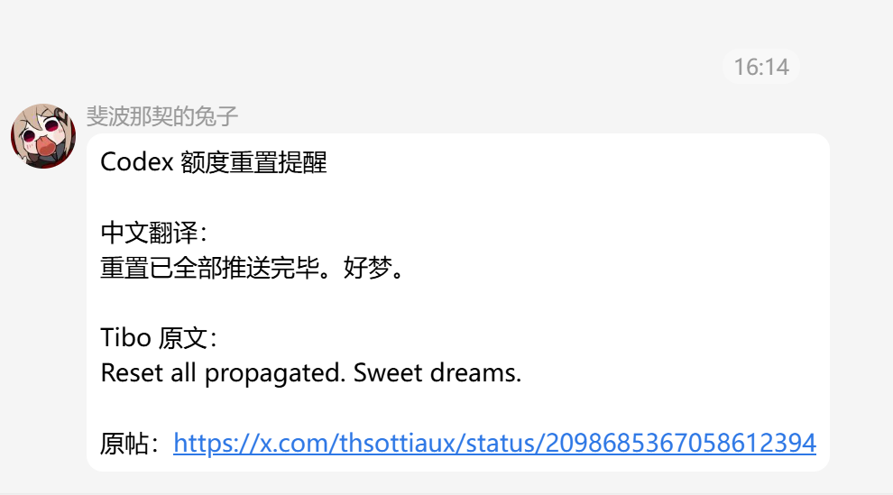

# Codex Reset Watcher（Codex 额度重置提醒）

一个给 MaiBot 用的 Codex 重置提醒插件：自动关注 Codex 全局额度重置、Banked Reset 和上游重置告警，并把重要消息翻译成中文后发送到指定 QQ 群。

- 当前版本：**0.2.0**
- 运行环境：MaiBot Host `1.2.4 – 1.3.5`、SDK `2.8.0 – 2.10.0`（以插件清单声明为准）
- 许可证：MIT

## 你会得到什么

安装并配置好群号后，插件会在后台自动检查公开的 Codex 重置信息。没有新消息时不会打扰你；出现值得提醒的动态时，会发送到 QQ 群。

| 场景 | 你会收到的提醒 |
| --- | --- |
| Codex 全局额度重置 | 上游已经确认值得告警的重置消息，以及后续确认生效的消息 |
| Banked Reset | 上游推送给用户的 Banked 动态，包括生命周期状态暂时不明确但上游已经决定推送的事件 |
| 重置告警 | 数据源面向用户发布的其它 Codex 重置相关告警 |

文字通知（包括图片失败后的文字回退）通常包含：

**中文翻译 → Tibo 原文（或原文摘录）→ 原帖链接**

监测账户产生的事件可能没有推文。这类通知展示「上游通知」正文与「来源」页面，不把事件 ID 当作推文 ID。

翻译由 MaiBot 自带的大模型完成。原文说什么就翻什么，不做摘要；能可靠确定的时间会换算成北京时间并自然融入译文。即使翻译失败，提醒本身也会继续发送。

> 插件只读取公开数据，不登录你的 OpenAI 账号，不读取你的 Codex 额度，也不会替你执行任何重置操作。

## 实际效果

以下截图来自真实 QQ 群里的插件通知：

<p align="center">
  
</p>

图片模式的本地效果预览：[普通 Tweet](docs/preview/tweet.png)、
[引用帖](docs/preview/tweet-quote.png)、[引用投票](docs/preview/tweet-quote-poll.png)、
[系统通知](docs/preview/system.png)。预览使用演示正文或明确标注的真实投票快照，
不冒充新的真实 QQ 投递。

## 快速开始

### 方式一：MaiBot 插件市场

插件上架 MaiBot 插件市场后，推荐直接在插件市场搜索 **Codex 额度重置提醒** 安装。

安装后：

1. 启用插件；
2. 打开插件的 WebUI 配置页；
3. 在 `group_ids` 中添加需要接收提醒的 QQ 群号；
4. 保存配置即可。

### 方式二：手动安装

1. 下载或克隆本仓库；
2. 在 MaiBot 的插件目录（plugins/）下直接 clone 本仓库，或将整个仓库目录放入插件目录；
3. 让 MaiBot 加载并启用插件；
4. 在 WebUI 中配置接收提醒的 QQ 群。

不需要申请 OpenAI API key，也不需要 X（Twitter）API key。

## 常用配置

日常使用基本只需要 WebUI，不必手动修改配置文件。

```toml
[watcher]
group_ids = []            # 接收提醒的 QQ 群，例如 ["100000001"]
check_interval = 240      # 检查间隔，默认 240 秒（4 分钟）
tibo_full_push = false    # Tibo 主动动态全推送，默认关闭
display_mode = "text"    # text / image，默认文字；图片失败回退文字
timezone = "Asia/Shanghai"

[llm]
enabled = true            # 是否启用中文翻译
model_task = "replyer"    # WebUI 推荐选择：replyer / planner / utils
```

完整默认配置示例见 [config.example.toml](config.example.toml)。实际 `config.toml` 由 MaiBot 在运行时根据插件配置模型生成和维护，无需手动放置。

## Tibo 动态与图片通知

`tibo_full_push = true` 新增独立动态车道，从公开 feed 的 Tibo timeline 中推送普通发帖、长帖和有自己评论的引用帖，排除回复他人，保留明确回复自己的续帖；回复对象不明确、纯转发和只有链接的分享不推送。回复对象的大小写和可选前导 `@` 会规范化。首次开启或新加群时静默建立本群历史基线，之后按群推送新发现的动态；缺失必要回复元数据或时间的数据等待后续补齐。超过现有 48 小时年龄护栏的历史动态不补发。

既有四个告警车道继续工作。有明确 Tweet 身份的通知，只有在本群已成功收到同一动态时才被吸收；动态在途时暂缓且不写 receipt，失败或取消后既有告警可以重试。系统观测和无 Tweet 来源的告警继续投递。旧车道先成功投递、timeline 后恢复时，也通过成功的 Tweet coverage 避免重复。基线、年龄排除和其它群的 receipt 都不是本群成功投递证据。

`display_mode = "image"` 将所有活跃车道切换为图片通知。图片使用仓库 HTML / CSS 模板，经 MaiBot Host 的 `render.html2png` 本地浏览器截图，再通过 `send.image` 发送。一条管线的图片由各群共享；生成失败、超时、结果无效或某群发图失败，只向该群回退文字。成功发图不追加文字；文字回退成功后同样记录正常 receipt，不再补图。文字和图片都失败则不记 receipt，下一轮独立重试。

- Tweet 模板：保留通知标题，显示 Tibo 头像、名称和 `@thsottiaux`，完整中文译文在英文原文之上。时间使用 `YYYY-MM-DD HH:MM` 与 `UTC+8` 标签。
- 系统模板：明确显示“系统 / 上游通知”，不显示 Tibo 账号或头像。无发布时间时使用本次生成时间。
- 引用帖：有引用正文或结构化投票才显示独立引用区；引用也整块翻译，译文在原文之上。主帖正文与引用正文独立选择，已取得的引用正文不会随主帖候选切换而丢失；图片模式可继续下一级 Provider 补引用，文字模式不为引用额外等待。引用正文缺失时完全隐藏引用区，暂不处理引用媒体。
- 引用投票：FxTwitter / VxTwitter / feed 的结构化 poll 独立补全，选项首行展示原文及括号内中文译文（emoji 只显示一次），次行展示比例条及一位小数百分比，底部展示总票数及可靠截止状态。这是生成通知时的快照；未取得可靠截止信息时明确显示状态未知，未取得选项时显示“投票内容暂不可用”。不推测 viewer 的选中标记。数字不交给 LLM，选项翻译失败保留原文；不改变告警、去重、receipt 或文字回退。真实 schema 与边界见 [引用投票说明](docs/quoted-poll.md)。
- 图片不独立展示主帖、系统来源及引用帖的来源 URL；正文和译文中本来存在的网址正常保留，内部来源元数据保留。文字模式及图片失败后的文字回退继续保留原有来源链接。
- 图片中英文字体使用本地打包的 Noto Sans SC / Noto Sans WOFF2 子集，统一 CSS 字族，覆盖全部 GB2312 常用汉字及更广的基本汉字区；标题和姓名为 600，正文、账号与时间为 400。无需 CDN，字体许可、体积及构建方法见 [字体归属说明](templates/assets/ATTRIBUTION.md)。
- 翻译失败或禁用时保留原文，告警本身继续投递。浏览器、字体或 Host 渲染能力缺失时回退文字。

配置结构版本为 **1.3.0**，与插件版本分开管理。0.2.0 没有改变配置 schema，
升级仍由 Host 保留用户已有值，不重建 receipt/state。
Host 管理 Playwright、Chromium 与系统库；插件不新增浏览器/Python runtime dependency。
首次 browser 下载可能较慢，建议先准备 Host 渲染环境。渲染关闭、缺包、缺浏览器、
下载/RPC/截图或发图失败时按群回退文字。manifest/版本拒绝加载发生在插件运行前，
此时无法执行 fallback。SDK 2.8.1 有已知模型任务解析回归，建议使用 2.8.2 及以上。
完整准备方法与降级合同见 [图片通知说明](docs/image-notifications.md)。

## 多群支持

可以同时配置多个 QQ 群。每个群独立发送、独立记录、独立重试：一个群发送失败不会影响其它群。

同一条已经成功发送的告警不会在同一群里反复发送；如果上游把同一件事分成“宣布”“确认生效”等不同阶段分别告警，插件也会按上游实际告警分别提醒。

## 中文翻译

开启翻译后，插件会复用 MaiBot 已有的大模型能力，把 Tibo 原文完整翻译成简体中文。

- 不总结、不压缩、不删减；
- 歌词、玩笑、寒暄、重复内容也会正常翻译；
- 能可靠确定的时间会换算成北京时间；
- 翻译失败或超时，只会少一段中文翻译，不会阻止告警发送；
- 如果拿不到可靠的推文原文，插件不会拿摘要冒充原文；文字模式和文字回退保留标题和原帖链接，图片不展示链接。

不想使用翻译时，在 WebUI 中关闭 `llm.enabled` 即可。

## Banked Reset 是什么

Banked Reset 不是“当前额度立刻刷新”。

它更接近“把一次重置机会存进账户，之后再由你使用”。因此看到 Banked Reset 提醒时，不要把它理解成当前 Codex 额度已经自动恢复。

插件只负责把上游发布的 Banked 动态及时转发到 QQ，不会替你兑换或使用 Banked Reset。

## 可靠性与已知限制

插件的基本原则是：上游决定什么值得告警，插件负责把已经成立的告警可靠地镜像到 QQ。插件不会再根据 Tweet 文本自己猜“这条到底该不该发”。

发送状态按 QQ 群分别保存。某个群发送失败时，下次会继续重试；已经成功的群不会因此重复发送。

但需要诚实说明一个上游限制：部分 Banked 推送接口只提供“当前最新一条”，没有完整历史记录或游标。

因此，如果插件停机，或者两次检查之间某条 Banked 推送很快又被下一条推送覆盖，那么已经消失的那条消息可能无法找回。插件覆盖的是检查时仍然可见的上游 Banked 推送，不承诺离线恢复或被覆盖后的补偿。

这不是通过增加本地关键词判断就能可靠解决的问题；完整离线恢复需要上游提供带历史记录或游标的告警接口。

## 常见问题

**重启 MaiBot 后会重复发以前的消息吗？**
正常不会。插件会把已经成功发送的通知记录保存在 MaiBot 数据目录的 `reset_state.json` 中，重启后继续按记录去重。

**离线期间的消息一定能补回来吗？**
不能保证。对于有历史记录的数据可以继续正常判断，但对于只提供“最新一条”的上游推送，如果消息在插件重新看到之前已经被覆盖，就无法从当前接口恢复。

**某个群发送失败怎么办？**
不会影响其它群。失败的群不会写入成功记录，后续检查时会单独重试。

**为什么通知里的时间是北京时间？**
插件面向中文 QQ 群使用，能够可靠确定的时间会按 `Asia/Shanghai` 转换并展示。

**通知太频繁怎么办？**
可以调大 `check_interval`。没有新事件时插件不会发送消息。

**翻译不准怎么办？**
翻译由大模型生成，仅作为阅读辅助。通知会尽量保留 Tibo 原文或原文摘录；文字模式及图片失败后的文字回退保留原帖链接，方便你自行核对。

**从旧版本升级会丢群配置吗？**
不会。旧的单群配置 `group_id` 会自动迁移到多群列表 `group_ids`。

## 0.2.0 更新

Tibo 全推送、图片通知、引用与投票正式纳入功能文档。Tibo 动态并发准备，逐群按真实
时间投递；跨轮在途帖也约束较新帖。失败/异常/取消释放该群屏障，该群尝试完成后
不会因其它群仍在发送而阻塞旧告警车道。

发布工程清理安装树、减少常见图片的字体传输，保留所有原有基本汉字及完整回归测试。
详细更新见 [CHANGELOG.md](CHANGELOG.md)，工程证据与已知边界见
[PRE_MAIN_AUDIT.md](PRE_MAIN_AUDIT.md)。

## 版本与兼容性

- 当前版本：0.2.0
- MaiBot Host：`1.2.4 – 1.3.5`
- MaiBot SDK：`2.8.0 – 2.10.0`

以上范围基于正式 tag、所需 API 与独立 loader/render 验证；不代表所有中间组合都经过逐一实测。默认仍为文字，图片为可选模式。config_version 保持 1.3.0。

## 问题反馈与许可

- 问题与建议：[GitHub Issues](https://github.com/ShiinaWhite/Codex-Reset-Watcher/issues)
- 开源协议：[MIT](LICENSE)
- 插件代码：[plugin.py](plugin.py)
- 插件清单：[_manifest.json](_manifest.json)
