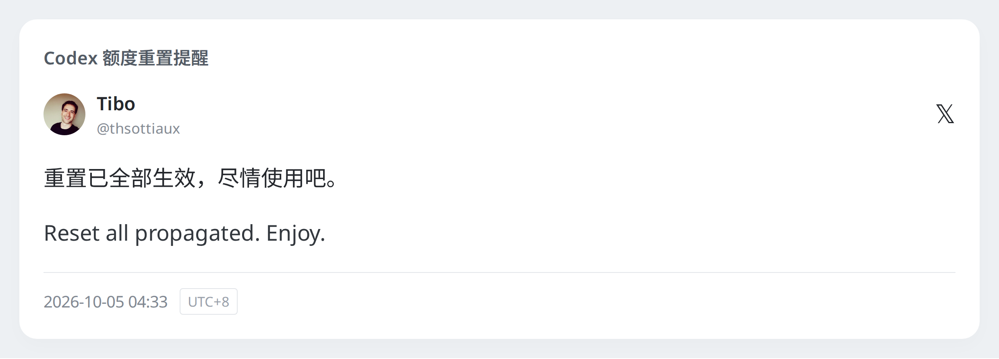
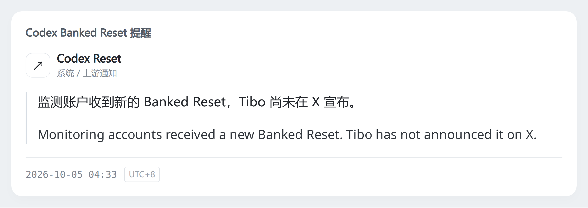
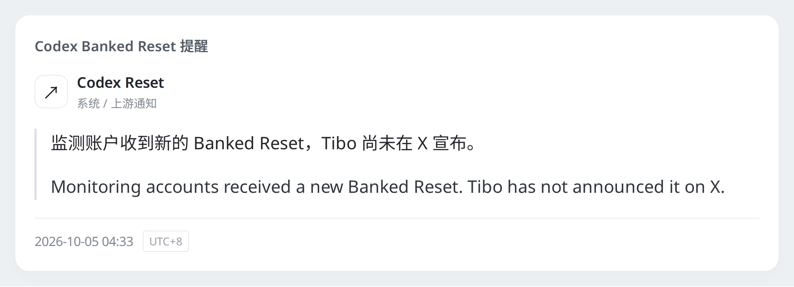

# Typography before / after

基线为 `bedba78af09e87fa8196aa1a6936b81f919cc281`。两组均由当前
`tools/preview_cards.py` 在同一台本地 Chromium 中现场生成，使用相同文案、
视口与像素密度；before 为旧字体方案，中文使用本地系统 fallback。
这里不是生产 Host / QQ 实发对比。

| 卡片 | Before | After |
| --- | --- | --- |
| 普通 Tweet | [原图](before-typography/tweet.png) | [新图](tweet.png) |
| 带 quote 的 Tweet | [原图](before-typography/tweet-quote.png) | [新图](tweet-quote.png) |
| 系统通知 | [原图](before-typography/system.png) | [新图](system.png) |

## 普通 Tweet

Before：

After：

## 带 quote 的 Tweet

Before：

After：

## 系统通知

Before：

After：

所有尺寸/左右栏的 CSS 参数保持原样，字号、行高、间距、颜色和圆角也未改。
图片宽度仍为 2480px；字体度量与自然换行造成自适应高度略有差异。
